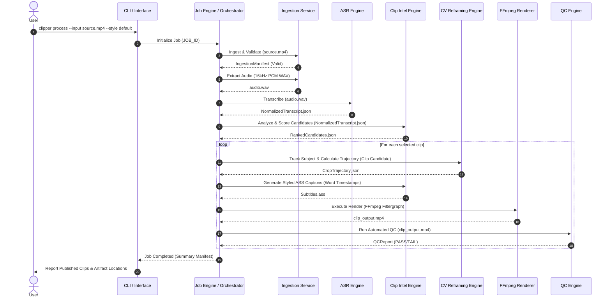

# SYSTEM FLOWS — LOCAL AI CLIPPER

## 1. End-to-End Processing Workflow

## 2. Pipeline Error & Recovery Flow
1. **Stage Checkpointing:** Before executing any stage, the Job Engine checks `job_manifest.json` for completed stage checksums.
2. **Transient Error Retry:** If a stage fails due to a transient exception (e.g. LLM API rate limit or subprocess timeout), it retries up to 3 times using exponential backoff.
3. **Permanent Failure Isolation:** If a clip render or QC check fails for a specific clip, that clip is marked `FAILED` in the manifest without aborting the overall job.
4. **Resumption:** Rerunning `clipper retry --job JOB_ID` automatically resumes processing from the first uncompleted or failed stage.
